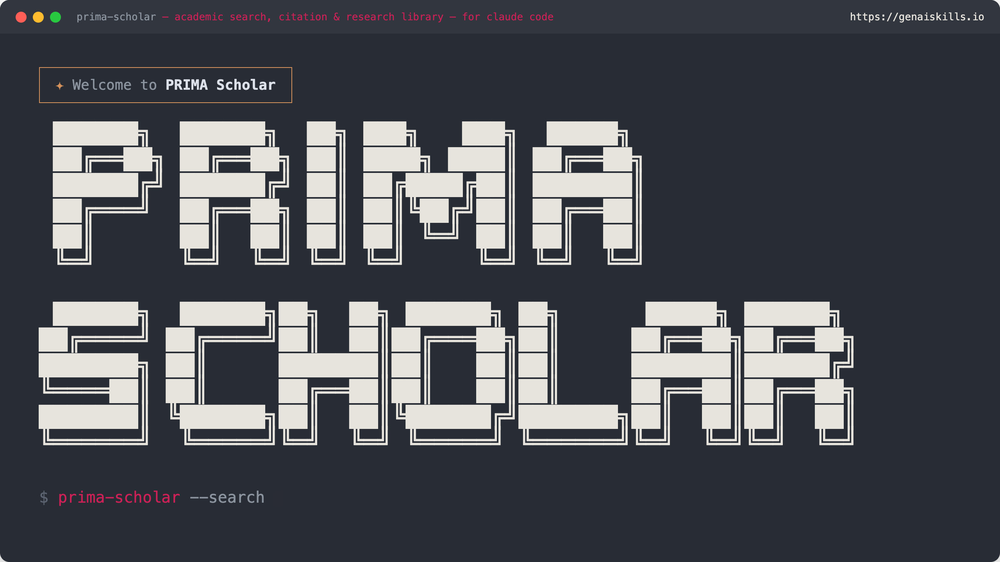

# PRIMA Scholar v2.0.1

A research workspace plugin for [Claude Code](https://docs.anthropic.com/en/docs/claude-code) and [Claude Desktop](https://claude.ai/download). Search 10 academic databases, manage a local document library, and write with properly formatted citations.

## What It Does

- **Academic Search** -- Search PubMed, arXiv, Semantic Scholar, CrossRef, OpenAlex, CORE, Europe PMC, ERIC, bioRxiv/medRxiv, and DBLP from a single interface
- **Search Wizard** -- Analyses your query, detects your discipline, and recommends the best databases to search before you run a query
- **Open Access First** -- Every result shows whether it is open access or gated. OA papers are prioritised in results. Filter to OA-only with a single parameter
- **Full-Text Retrieval** -- Fetch the full text of open access papers directly from CORE, Europe PMC, arXiv, and bioRxiv
- **Document Library** -- Import PDFs, Word documents, and text files into a local SQLite database with full-text search, collections, and tagging
- **Multi-Style Citations** -- Generate citations in APA7, Harvard, Chicago, Vancouver, IEEE, and MLA formats
- **Citation Tracking** -- Follow citation chains forward (who cited this paper?) and backward (what does it cite?)
- **Citation-Aware Writing** -- Draft prose with inline citations drawn from your library and search results
- **Research Agent** -- Autonomous multi-step research: decomposes questions, searches databases, follows citation chains, produces cited synthesis

## Databases

| Database | Coverage | Auth | OA Info |
|----------|----------|------|---------|
| **[OpenAlex](https://openalex.org/)** | 250M+ works, all disciplines | No (polite pool with email) | OA status per paper |
| **[PubMed](https://pubmed.ncbi.nlm.nih.gov/)** | Biomedical, life sciences | Optional API key | Varies |
| **[arXiv](https://arxiv.org/)** | Physics, maths, CS, biology, finance, stats | No | All OA (preprints) |
| **[Semantic Scholar](https://www.semanticscholar.org/)** | All disciplines + citation graph | Optional API key | OA status per paper |
| **[CrossRef](https://www.crossref.org/)** | DOI metadata, all disciplines | No (polite pool with email) | OA via licence metadata |
| **[CORE](https://core.ac.uk/)** | 300M+ open access papers | Free API key required | All OA |
| **[Europe PMC](https://europepmc.org/)** | Biomedical + European research council | No | OA status per paper |
| **[ERIC](https://eric.ed.gov/)** | Education research | No | Full text for many |
| **[bioRxiv/medRxiv](https://www.biorxiv.org/)** | Biology and medicine preprints | No | All OA (preprints) |
| **[DBLP](https://dblp.org/)** | Computer science bibliography | No | Metadata only |

## Installation

### Claude Code (Full Plugin)

```bash
git clone https://github.com/larrygmaguire-hash/prima-scholar.git
cd prima-scholar

# Build both MCP servers
cd mcp-servers/prima-scholar-search-mcp && npm install && npm run build && cd ../..
cd mcp-servers/prima-scholar-library-mcp && npm install && npm run build && cd ../..

# Install commands, skills, agents, and register MCP servers
./install.sh /path/to/your/workspace
```

The install script copies slash commands (`/scholar`, `/library`, `/cite`), skills, and agents into the target workspace's `.claude/` directory, and registers the MCP servers in `~/.claude.json` if not already present. Run it again after pulling updates to sync any new or changed files.

### Claude Desktop (MCP Servers Only)

Add to your Claude Desktop configuration (`claude_desktop_config.json`):

```json
{
  "mcpServers": {
    "prima-scholar-search": {
      "command": "node",
      "args": ["/path/to/prima-scholar/mcp-servers/prima-scholar-search-mcp/build/index.js"],
      "env": {
        "OPENALEX_MAILTO": "your@email.com",
        "CROSSREF_MAILTO": "your@email.com",
        "CORE_API_KEY": "your-core-api-key"
      }
    },
    "prima-scholar-library": {
      "command": "node",
      "args": ["/path/to/prima-scholar/mcp-servers/prima-scholar-library-mcp/build/index.js"],
      "env": {
        "RESEARCH_LIBRARY_PATH": "~/.research-library/library.db"
      }
    }
  }
}
```

You can install either server independently. The search server has no dependency on the library server.

## Configuration

All environment variables are optional except `CORE_API_KEY` (required only if you want to search CORE). The plugin works with zero configuration across the other 9 databases.

| Variable | Purpose | How to Get |
|----------|---------|------------|
| `OPENALEX_MAILTO` | Polite pool for OpenAlex (higher rate limits) | Use your email address |
| `CROSSREF_MAILTO` | Polite pool for CrossRef (higher rate limits) | Use your email address |
| `PUBMED_API_KEY` | Higher PubMed rate limit (3/sec to 10/sec) | https://www.ncbi.nlm.nih.gov/account/ |
| `SEMANTIC_SCHOLAR_KEY` | Higher Semantic Scholar rate limit | https://www.semanticscholar.org/product/api |
| `CORE_API_KEY` | Required to search CORE (free) | https://core.ac.uk/services/api |
| `RESEARCH_LIBRARY_PATH` | Custom database file location | Default: `~/.research-library/library.db` |

API keys are stored in your local environment. They are never committed to code or transmitted beyond the API they authenticate with.

## Citation Styles

PRIMA Scholar supports multiple academic citation formats. Specify your preferred style when searching or writing.

| Style | Example |
|-------|---------|
| **APA7** | Dweck, C. S. (2006). *Mindset: The new psychology of success*. Random House. |
| **Harvard** | Dweck, C.S. (2006) *Mindset: The new psychology of success*. Random House. |
| **Chicago** | Dweck, Carol S. *Mindset: The New Psychology of Success*. Random House, 2006. |
| **Vancouver** | Dweck CS. Mindset: the new psychology of success. Random House; 2006. |
| **IEEE** | C. S. Dweck, *Mindset: The New Psychology of Success*. Random House, 2006. |
| **MLA** | Dweck, Carol S. *Mindset: The New Psychology of Success*. Random House, 2006. |

Default style is APA7. Set your preference with the `citation_style` parameter on any search or citation tool.

## Commands (Claude Code)

| Command | Description |
|---------|-------------|
| `/scholar [topic]` | Start a research session |
| `/cite [DOI or title]` | Quick citation lookup |
| `/library [action]` | Library management: import, search, collections, stats |

## Skills (Claude Code)

| Skill | Triggers |
|-------|----------|
| `researching-topics` | "research [topic]", "find papers on", "literature review" |
| `managing-research-library` | "import this paper", "search my library", "organise research" |
| `writing-with-citations` | "write with citations", "draft with references", "write in Harvard style" |

## MCP Tools

### Search Server (5 tools)

| Tool | Description |
|------|-------------|
| `scholar_wizard` | Analyse a query, detect discipline, generate refinement questions before searching |
| `scholar_search` | Unified search across up to 10 databases with OA prioritisation and deduplication |
| `scholar_get_paper` | Get paper by any identifier (DOI, PMID, arXiv ID, OpenAlex ID, ERIC ID, etc.) |
| `scholar_citations` | Forward and backward citation tracking via Semantic Scholar |
| `scholar_full_text` | Retrieve full text of open access papers from CORE, Europe PMC, arXiv, bioRxiv |

### Library Server (12 tools)

| Tool | Description |
|------|-------------|
| `library_import` | Import a PDF, DOCX, TXT, or MD file |
| `library_import_from_search` | Import a paper from search results |
| `library_search` | Full-text search with snippets |
| `library_get_document` | Get full document by ID |
| `library_list` | List documents with filters |
| `library_update` | Update document metadata |
| `library_delete` | Remove a document |
| `library_create_collection` | Create a named collection |
| `library_list_collections` | List collections with counts |
| `library_add_to_collection` | Add document to collection |
| `library_tag` | Add or remove tags |
| `library_stats` | Library statistics |

## Discipline Detection

The search wizard analyses your query and routes to the strongest databases for your field:

| Discipline | Primary Databases |
|------------|-------------------|
| Psychology | OpenAlex, Semantic Scholar, PubMed |
| Education | ERIC, OpenAlex, Semantic Scholar |
| Neuroscience | PubMed, Europe PMC, bioRxiv |
| Business and Management | OpenAlex, Semantic Scholar, CrossRef |
| Computer Science and AI | Semantic Scholar, arXiv, DBLP |
| Philosophy and Humanities | OpenAlex, CrossRef |
| Biomedical and Life Sciences | PubMed, Europe PMC, bioRxiv/medRxiv |
| Engineering | OpenAlex, Semantic Scholar, arXiv |
| Social Sciences | OpenAlex, Semantic Scholar, CrossRef |
| Mathematics and Physics | arXiv, Semantic Scholar, OpenAlex |
| Economics | OpenAlex, CrossRef, Semantic Scholar |

## Open Access Handling

Every paper in search results includes:

| Field | Type | Meaning |
|-------|------|---------|
| `openAccess` | boolean | Whether this paper is openly accessible |
| `openAccessUrl` | string or null | Direct URL to the OA version |
| `fullTextAvailable` | boolean | Whether `scholar_full_text` can retrieve the content |

Set `open_access_only: true` on `scholar_search` to exclude gated papers entirely. When set to false (default), OA papers appear first, gated papers appear second, and both counts are shown in the response.

## Rate Limits

Per-source rate limiting is built in. All limits respect API terms of service.

| Source | Limit (no key) | Limit (with key) |
|--------|---------------|-------------------|
| OpenAlex | 10 req/sec | N/A (polite pool) |
| PubMed | 3 req/sec | 10 req/sec |
| arXiv | 1 req/3 sec | N/A |
| Semantic Scholar | 100 req/5 min | Higher |
| CrossRef | 50 req/sec | N/A (polite pool) |
| CORE | 10 req/sec | N/A |
| Europe PMC | 10 req/sec | N/A |
| ERIC | 10 req/sec | N/A |
| bioRxiv/medRxiv | 5 req/sec | N/A |
| DBLP | 5 req/sec | N/A |

## Requirements

- Node.js 18+
- npm

## Part of the PRIMA Ecosystem

PRIMA Scholar is one of several PRIMA tools for Claude Code:

- **[PRIMA](https://github.com/larrygmaguire-hash/prima-plugin)** -- Project recording, indexing, and management
- **[PRIMA Memory](https://github.com/larrygmaguire-hash/prima-memory)** -- Session history and context recovery
- **PRIMA Scholar** -- Academic search and citation management (this plugin)

## Licence

MIT
